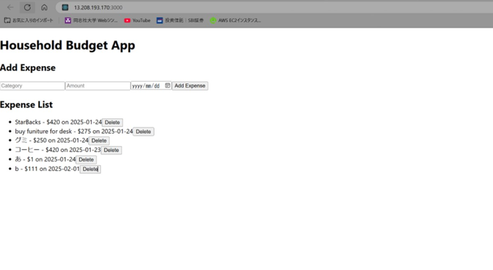
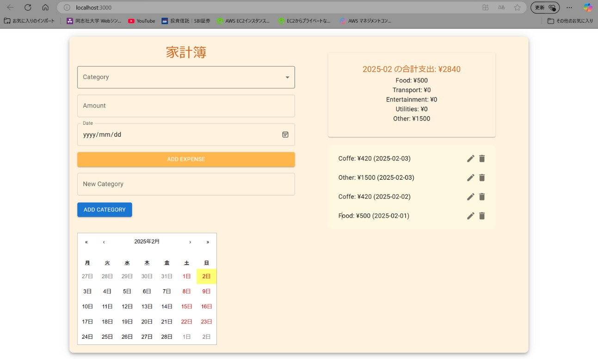
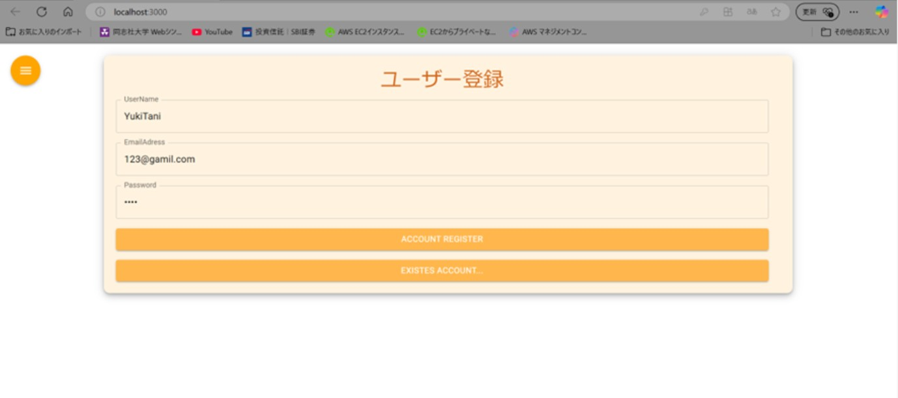
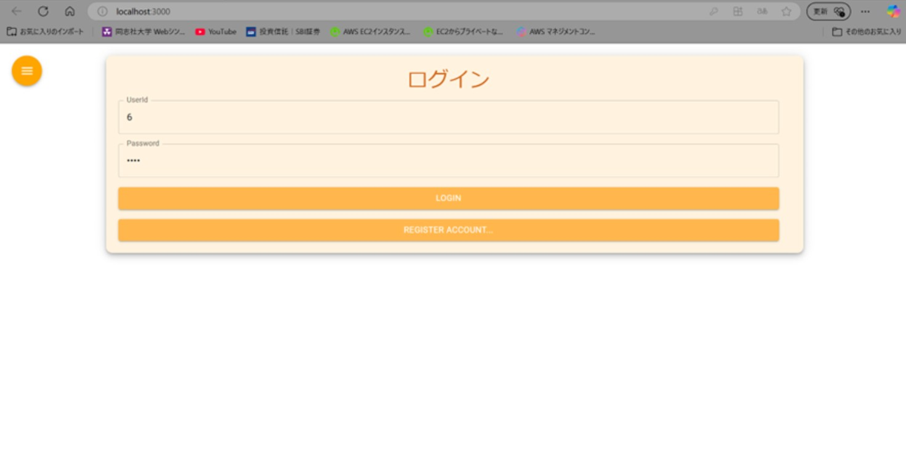

# 成果物説明
### 家計簿アプリ_v1
- EC2上にアプリケーションを構築(VPC, EC2, RDSを使用)
- CRUD操作の実装
- FE: thymeleaf / BE: Java(spring)

### 家計簿アプリ_v2
- FE変更
- ユーザー登録追加
- カレンダー追加（カレンダーを指定すると出費の確認ができる）
- 合計支出追加（カレンダーに合わせて表示月変更）
- FE: React / BE: Java(spring)

